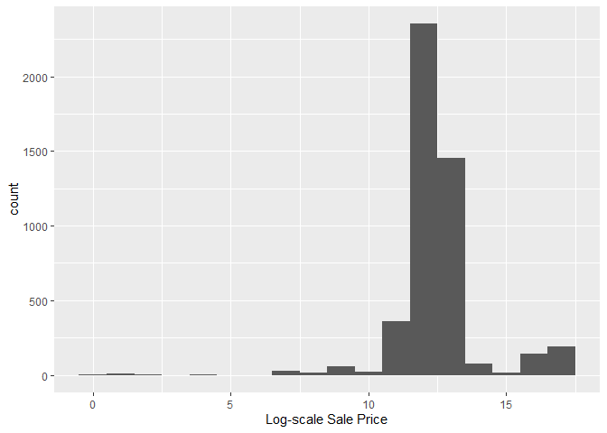
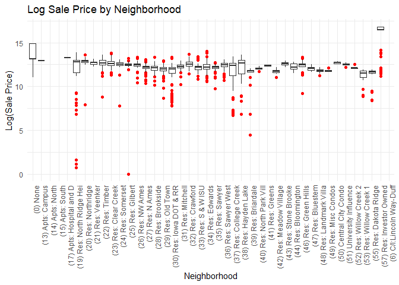
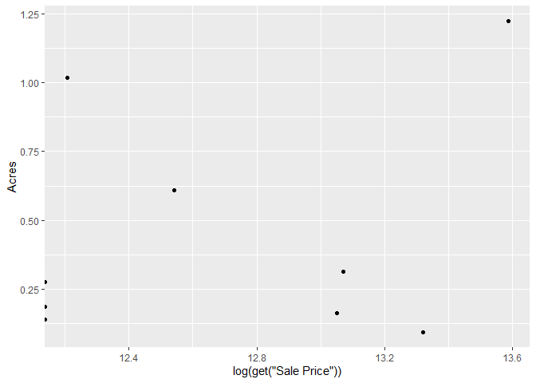
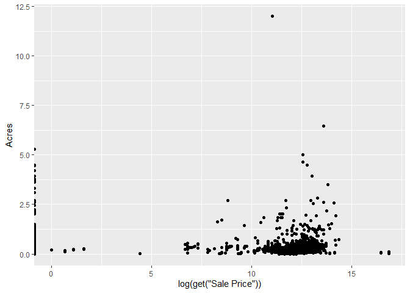
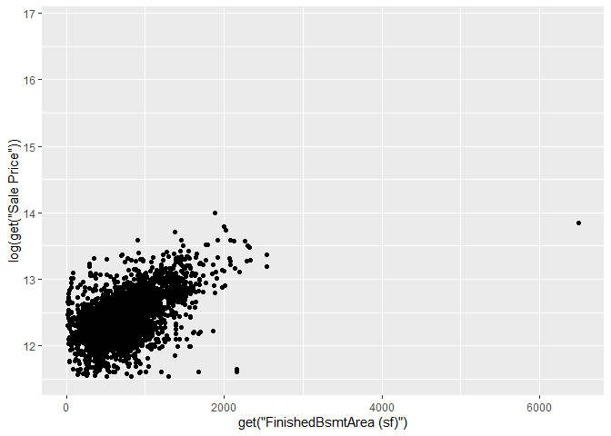
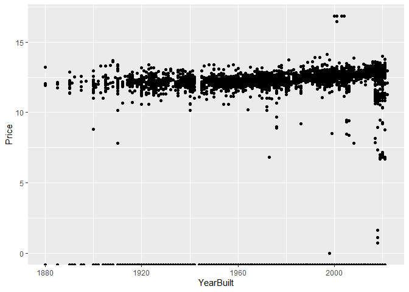

<!-- README.md is generated from README.Rmd. Please edit the README.Rmd file -->

# Lab report \#1

Follow the instructions posted at
<https://ds202-at-isu.github.io/labs.html> for the lab assignment. The
work is meant to be finished during the lab time, but you have time
until Monday evening to polish things.

Include your answers in this document (Rmd file). Make sure that it
knits properly (into the md file). Upload both the Rmd and the md file
to your repository.

All submissions to the github repo will be automatically uploaded for
grading once the due date is passed. Submit a link to your repository on
Canvas (only one submission per team) to signal to the instructors that
you are done with your submission.

### Step 1 Result

``` r
library(classdata)
library(tidyr)
```

    ## Warning: package 'tidyr' was built under R version 4.4.3

``` r
library(tidyverse)
```

    ## Warning: package 'tidyverse' was built under R version 4.4.3

    ## Warning: package 'readr' was built under R version 4.4.3

    ## Warning: package 'forcats' was built under R version 4.4.3

    ## Warning: package 'lubridate' was built under R version 4.4.3

    ## ── Attaching core tidyverse packages ──────────────────────── tidyverse 2.0.0 ──
    ## ✔ dplyr     1.1.4     ✔ purrr     1.0.4
    ## ✔ forcats   1.0.0     ✔ readr     2.1.5
    ## ✔ ggplot2   3.5.1     ✔ stringr   1.5.1
    ## ✔ lubridate 1.9.4     ✔ tibble    3.2.1
    ## ── Conflicts ────────────────────────────────────────── tidyverse_conflicts() ──
    ## ✖ dplyr::filter() masks stats::filter()
    ## ✖ dplyr::lag()    masks stats::lag()
    ## ℹ Use the conflicted package (<http://conflicted.r-lib.org/>) to force all conflicts to become errors

``` r
head(ames)
```

    ## # A tibble: 6 × 16
    ##   `Parcel ID` Address      Style Occupancy `Sale Date` `Sale Price` `Multi Sale`
    ##   <chr>       <chr>        <fct> <fct>     <date>             <dbl> <chr>       
    ## 1 0903202160  1024 RIDGEW… 1 1/… Single-F… 2022-08-12        181900 <NA>        
    ## 2 0907428215  4503 TWAIN … 1 St… Condomin… 2022-08-04        127100 <NA>        
    ## 3 0909428070  2030 MCCART… 1 St… Single-F… 2022-08-15             0 <NA>        
    ## 4 0923203160  3404 EMERAL… 1 St… Townhouse 2022-08-09        245000 <NA>        
    ## 5 0520440010  4507 EVERES… <NA>  <NA>      2022-08-03        449664 <NA>        
    ## 6 0907275030  4512 HEMING… 2 St… Single-F… 2022-08-16        368000 <NA>        
    ## # ℹ 9 more variables: YearBuilt <dbl>, Acres <dbl>,
    ## #   `TotalLivingArea (sf)` <dbl>, Bedrooms <dbl>,
    ## #   `FinishedBsmtArea (sf)` <dbl>, `LotArea(sf)` <dbl>, AC <chr>,
    ## #   FirePlace <chr>, Neighborhood <fct>

``` r
summary(ames)
```

    ##   Parcel ID           Address                        Style     
    ##  Length:6935        Length:6935        1 Story Frame    :3732  
    ##  Class :character   Class :character   2 Story Frame    :1456  
    ##  Mode  :character   Mode  :character   1 1/2 Story Frame: 711  
    ##                                        Split Level Frame: 215  
    ##                                        Split Foyer Frame: 156  
    ##                                        (Other)          : 218  
    ##                                        NA's             : 447  
    ##                           Occupancy      Sale Date            Sale Price      
    ##  Condominium                   : 711   Min.   :2017-07-03   Min.   :       0  
    ##  Single-Family / Owner Occupied:4711   1st Qu.:2019-03-27   1st Qu.:       0  
    ##  Townhouse                     : 745   Median :2020-09-22   Median :  170900  
    ##  Two-Family Conversion         : 139   Mean   :2020-06-14   Mean   : 1017479  
    ##  Two-Family Duplex             : 182   3rd Qu.:2021-10-14   3rd Qu.:  280000  
    ##  NA's                          : 447   Max.   :2022-08-31   Max.   :20500000  
    ##                                                                               
    ##   Multi Sale          YearBuilt        Acres         TotalLivingArea (sf)
    ##  Length:6935        Min.   :   0   Min.   : 0.0000   Min.   :   0        
    ##  Class :character   1st Qu.:1956   1st Qu.: 0.1502   1st Qu.:1095        
    ##  Mode  :character   Median :1978   Median : 0.2200   Median :1460        
    ##                     Mean   :1976   Mean   : 0.2631   Mean   :1507        
    ##                     3rd Qu.:2002   3rd Qu.: 0.2770   3rd Qu.:1792        
    ##                     Max.   :2022   Max.   :12.0120   Max.   :6007        
    ##                     NA's   :447    NA's   :89        NA's   :447         
    ##     Bedrooms      FinishedBsmtArea (sf)  LotArea(sf)          AC           
    ##  Min.   : 0.000   Min.   :  10.0        Min.   :     0   Length:6935       
    ##  1st Qu.: 3.000   1st Qu.: 474.0        1st Qu.:  6553   Class :character  
    ##  Median : 3.000   Median : 727.0        Median :  9575   Mode  :character  
    ##  Mean   : 3.299   Mean   : 776.7        Mean   : 11466                     
    ##  3rd Qu.: 4.000   3rd Qu.:1011.0        3rd Qu.: 12088                     
    ##  Max.   :10.000   Max.   :6496.0        Max.   :523228                     
    ##  NA's   :447      NA's   :2682          NA's   :89                         
    ##   FirePlace                            Neighborhood 
    ##  Length:6935        (27) Res: N Ames         : 854  
    ##  Class :character   (37) Res: College Creek  : 652  
    ##  Mode  :character   (57) Res: Investor Owned : 474  
    ##                     (29) Res: Old Town       : 469  
    ##                     (34) Res: Edwards        : 444  
    ##                     (19) Res: North Ridge Hei: 420  
    ##                     (Other)                  :3622

- Some of the variables in the data include Parcel ID(Categorical),
  Address(categorical), Style(categorical), Sale data(categorical), Sale
  price(numerical), LotArea(sf)(numerical),FinishedBsmtArea
  (sf)(numerical),Bedrooms(numerical),acres(numerical),YearBulit(categorical),AC(categorical),
  andFireplace(categorical)

### Step 2 Result

- The main variable we’re focusing on presently is Sale Price.

### Step 3 Result

``` r
library(ggplot2)


ggplot(


  data=ames, 


  aes(x=log(get('Sale Price')))


)+ 


  geom_histogram(binwidth=1)+


  labs(x="Log-scale Sale Price")
```

    ## Warning: Removed 2206 rows containing non-finite outside the scale range
    ## (`stat_bin()`).

<!-- -->

- Running the histogram outside of log scale reveals very large
  outliers. There are also some very low numbers. The total range is
  from 0 to 20 million \### Step 4 Result

- Gwen’s Results:

  ``` r
  # This varible holds the log of sale price
  ames$LogSalePrice <- log(ames$`Sale Price`)

  # This is a box plot of neighborhood vs the log sale price 
  ggplot(ames, aes(x = Neighborhood, y = LogSalePrice)) +
    geom_boxplot(outlier.colour = "red") +
    labs(title = "Log Sale Price by Neighborhood", x = "Neighborhood", y = "Log(Sale Price)") +
    theme_minimal() +
    theme(axis.text.x = element_text(angle = 90, hjust = 1))
  ```

      ## Warning: Removed 2206 rows containing non-finite outside the scale range
      ## (`stat_boxplot()`).

  <!-- -->

  ``` r
  # Find the top and bottom 5 neighborhoods
  top_neighborhoods <- ames %>%
    group_by(Neighborhood) %>%
    summarise(MedianPrice = median(`Sale Price`, na.rm = TRUE)) %>%
    arrange(desc(MedianPrice)) %>%
    head(5)

  bottom_neighborhoods <- ames %>%
    group_by(Neighborhood) %>%
    summarise(MedianPrice = median(`Sale Price`, na.rm = TRUE)) %>%
    arrange(MedianPrice) %>%
    head(5)

  # Print the most and least expensive neighborhoods
  top_neighborhoods
  ```

      ## # A tibble: 5 × 2
      ##   Neighborhood              MedianPrice
      ##   <fct>                           <dbl>
      ## 1 (57) Res: Investor Owned     14200000
      ## 2 (0) None                       525000
      ## 3 (20) Res: Northridge           320000
      ## 4 (50) Central City Condo        300000
      ## 5 (51) University Influence      279000

  ``` r
  bottom_neighborhoods
  ```

      ## # A tibble: 5 × 2
      ##   Neighborhood              MedianPrice
      ##   <fct>                           <dbl>
      ## 1 (14) Apts: North                    0
      ## 2 (15) Apts: South                    0
      ## 3 (17) Apts: Hospital and D           0
      ## 4 (43) Res: Stone Brooke              0
      ## 5 (6) C/I:Lincoln Way-Duff            0

  - There is no range for the Neigborhood variable, since it is
    categorical. It appears that neighborhoods have an effect on Sale
    price. According to the box-plot, there are certain neighborhoods
    that have higher median sale prices. You would expect that nicer
    neighborhoods with luxury houses would have houses that are more
    expensive.

  - Outliers can be seen throughout the box plot and there seem to be
    quite a few in high-priced neighborhoods. Many neighborhoods show
    high variability indicating that houses in the same area can sell at
    a wide range of prices.

- Ben’s Results:

``` r
library(ggplot2)

df_clean <- drop_na(ames)
ggplot(df_clean, aes(x=log(get('Sale Price')), y=Acres)) + 
  geom_point()
```

<!-- -->

``` r
ggplot(ames, aes(x=log(get('Sale Price')), y=Acres)) + 
  geom_point()
```

    ## Warning: Removed 89 rows containing missing values or values outside the scale range
    ## (`geom_point()`).

<!-- -->

- Prices tend towards the same rough trends price wise, with larger lots
  tending to be more expensive, but not universally so. Relatively few
  legitimate outliers occur, with most lots tending to be roughy the
  same price and area. This is very reflective of the fact that most of
  the values fell into the same price range, with it being evident that
  they also all fall into the same rough acreage as well.

- Zach’s Results:

``` r
amesgreaterthan100000 <- subset(ames,get('Sale Price')>100000)
ggplot(amesgreaterthan100000, aes(x=get('FinishedBsmtArea (sf)'),y=log(get('Sale Price')) )) + 
  geom_point()
```

    ## Warning: Removed 1615 rows containing missing values or values outside the scale range
    ## (`geom_point()`).

<!-- --> - I started by excluding
houses where the sales price is below 100,000 dollars I did this because
I figured that there were circumstances around those sales prices that
would cause them to be problematic for data analysis. I also performed a
log transform on the sales price variable because the trend in the
untransformed data was non-linear There seems to be a moderately linear
trend in this data. There is an outlier in the x-direction at 6500. It
seems that sales prices generally increases as the amount of finished
basement area increases.

- Adrian’s Results:

``` r
ames2 <- subset(ames, YearBuilt>0)
ggplot(
  ames2,
  aes(x=YearBuilt, y=log(get('Sale Price')))
)+
  geom_point()+
  labs(y='Price')
```

<!-- -->

This plot does not reveal any explanations for irregularities. It seems
that sales price remains fairly constant over years, with the lesser
variety in older homes likely accounting for the smaller amount built
from that time.
